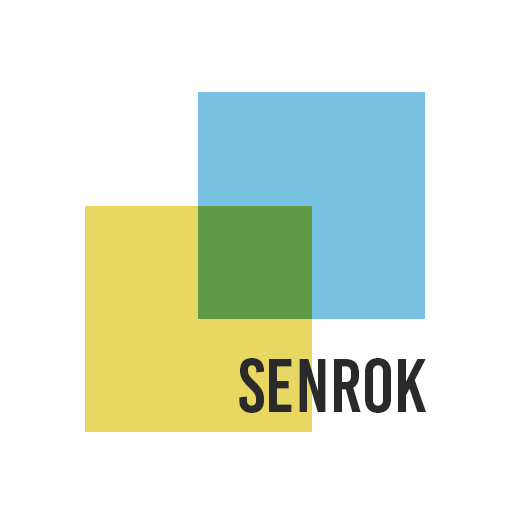

<p align="center"></p>
<p align="center">
<b>A project of SENROK Open Source</b>
</p>

# 

Go-odm, a Golang Object Document Mapping for MongoDB.

---

## Table of contents

- [Features](#features)
- [Installation](#installation)
- [Get started](#get-started)
- [Documentation](#documentation)
- [Testing / Development](#testing--development)
- [Contribution](#contribution--guidelines)
- [License](#license)

---

## Features
- Define your models and perform CRUD operations with hooks before/after each operation. 
- Built-in Soft-Delete
- Support the Multi-Database Instance
- Wrap the official Mongo Go Driver.
## Installation
```bash
go get github.com/senrok/go-odm
```

## Get started

Setup a db config:

```go
	opts, err := DefaultOpts(SetDatabase(MONGODB_URL, MONGODB_DB_NAME))
```

Define Model

```go
type Doc struct {
	DefaultModel `bson:",inline"`

	Name string `bson:"name"`
	Age  int    `bson:"age"`
}
```

Insert a new Document
```go
	err := opts.Coll(&doc).Create(context.TODO(), &doc)
```

Update a document
```go
        docs:=getYourData()
        updatedAt := docs[0].UpdatedAt
        docs[0].Name = "weny updated"
        err := opts.Coll(&Doc{}).UpdateOne(context.TODO(), docs[0])
```

Soft-Delete a document
```go
	err := opts.Coll(&Doc{}).SoftDeleteOne(context.TODO(), data[0])
```

Restore a document
```go
	err = opts.Coll(&Doc{}).RestoreOne(context.TODO(), data[0])
```

Delete a document 
```go
	err := opts.Coll(&Doc{}).DeleteOne(context.TODO(), data[0])
```

Find a document
```go
	err := opts.Coll(&Doc{}).FindOne(context.TODO(), bson.M{"name": "weny"}, &result)
```

### Transactions
```go
    err := opts.TransactionWithCtx(context.TODO(), func(session mongo.Session, sc mongo.SessionContext) error {

		err := opts.Coll(d).Create(sc, d)

		if err != nil {
			return err
		}

		return session.CommitTransaction(sc)
	})
```

## License

The Project is licensed under the Apache License.
